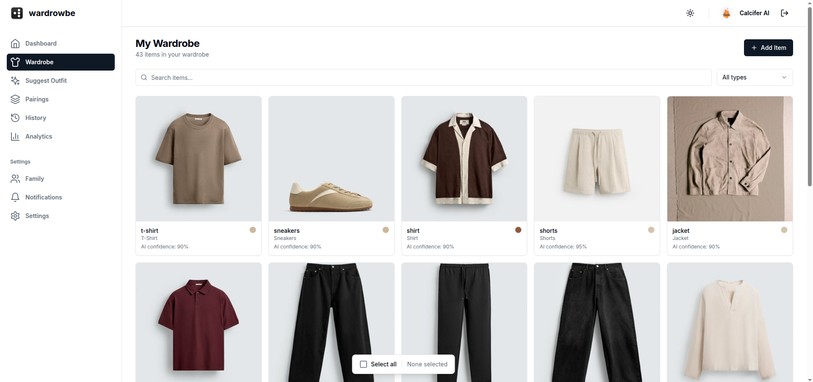
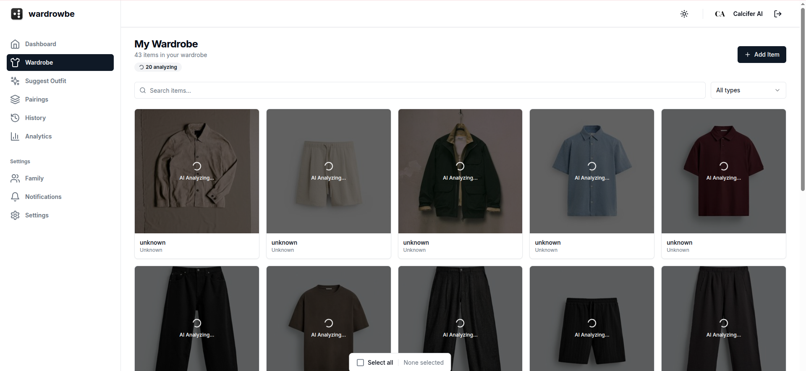
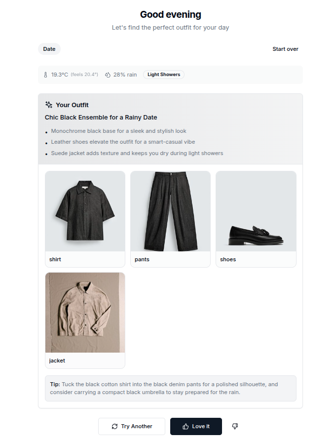
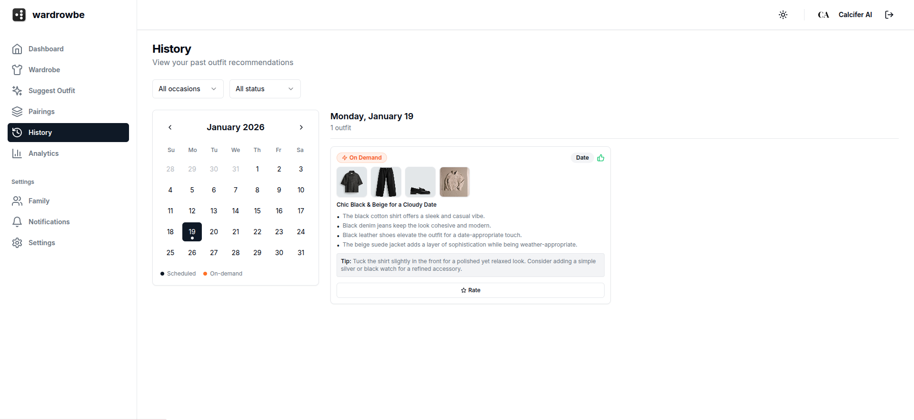
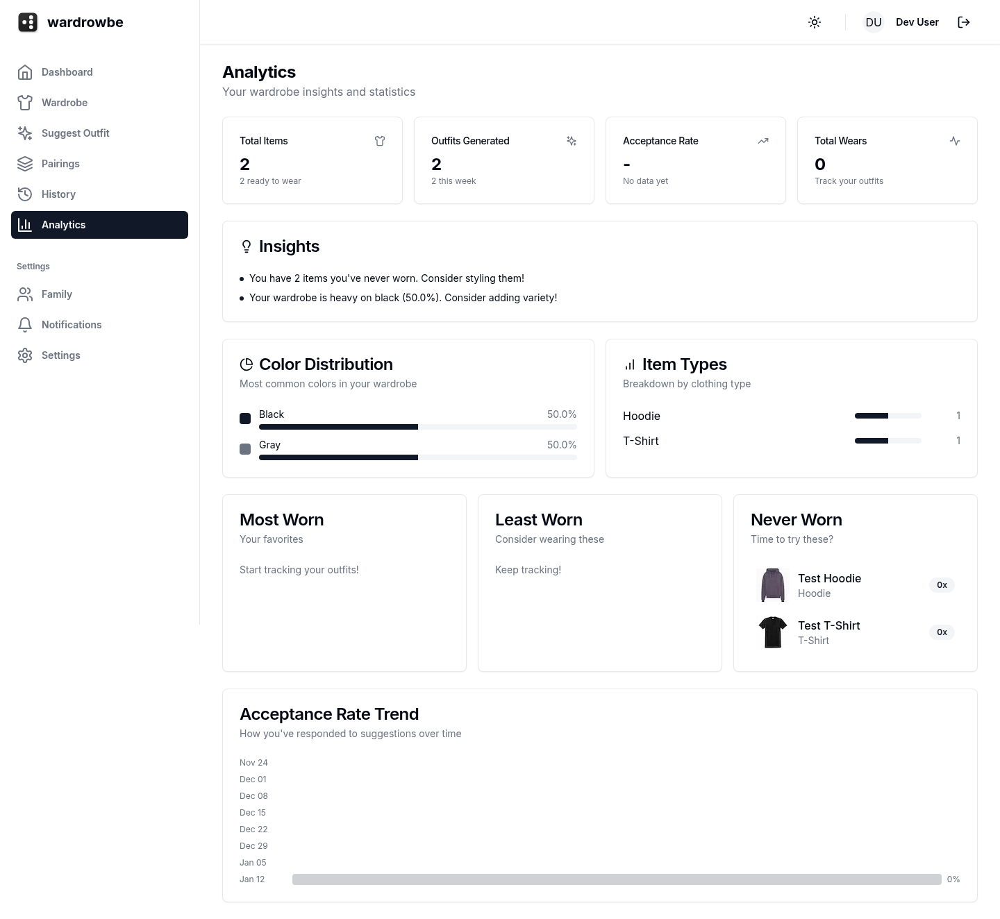
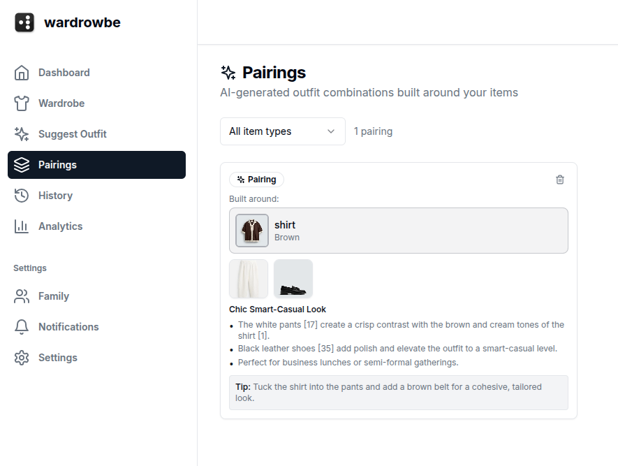

<p align="center">
  
</p>

<h1 align="center">wardrowbe</h1>

<p align="center">
  Put your wardrobe in rows. Snap. Organize. Wear.
</p>
<p align="center">
  <a href="https://claude.ai/code"></a>
  <a href="https://nextjs.org/"></a>
  <a href="https://fastapi.tiangolo.com/"></a>
  <a href="https://www.typescriptlang.org/"></a>
  <a href="https://www.python.org/"></a>
</p>

<p align="center">
  <a href="#features">Features</a> •
  <a href="#quick-start">Quick Start</a> •
  <a href="#deployment">Deployment</a> •
  <a href="#architecture">Architecture</a> •
  <a href="#contributing">Contributing</a>
</p>

<p align="center">
  <a href="https://buymeacoffee.com/anyesh">
    
  </a>
</p>

<p align="center">
  
  &nbsp;
  
</p>

Self-hosted wardrobe management with AI-powered outfit recommendations. Take photos of your clothes, let AI tag them, and get daily outfit suggestions based on weather and occasion.

## Features

- **Photo-based wardrobe** - Upload photos, AI extracts clothing details automatically
- **Smart recommendations** - Outfits matched to weather, occasion, and your preferences
- **Scheduled notifications** - Daily outfit suggestions via ntfy/Mattermost/email
- **Family support** - Manage wardrobes for household members
- **Wear tracking** - History, ratings, and outfit feedback
- **Analytics** - See what you wear, what you don't, color distribution
- **Fully self-hosted** - Your data stays on your hardware
- **Works with any AI** - OpenAI, Ollama, LocalAI, or any OpenAI-compatible API

## Screenshots

### Wardrobe & AI Tagging
| Wardrobe Grid | AI Analysis |
|---------------|-------------|
|  |  |

### Outfit Suggestions & History
| Suggestions | History Calendar |
|-------------|------------------|
|  |  |

### Analytics & Pairing
| Analytics | Pairing |
|-----------|---------------|
|  |  |

## Quick Start

### Prerequisites

- Docker and Docker Compose installed
- At least 4GB of RAM available
- An AI service (Ollama recommended for free local AI, or OpenAI API key)

### Setup

#### Step 1: Install Ollama (if using local AI)

**Option A: Using Ollama (Recommended - Free, runs locally)**

```bash
# Install Ollama from https://ollama.ai
# Then pull required models:
ollama pull gemma3        # Multimodel LLM (for image analysis and outfit recommendations)

# Verify it's running:
curl http://localhost:11434/api/tags
```

**Option B: Using OpenAI (Paid API)**

Get your API key from https://platform.openai.com/api-keys

#### Step 2: Clone and Configure

```bash
# Clone the repository
git clone https://github.com/yourusername/wardrowbe.git
cd wardrowbe

# Copy environment template
cp .env.example .env

# IMPORTANT: Edit .env and configure AI settings
# For Ollama (default in .env.example):
#   AI_BASE_URL=http://host.docker.internal:11434/v1
#   AI_VISION_MODEL=gemma3:latest
#   AI_TEXT_MODEL=gemma3:latest
#
# For OpenAI, uncomment and set:
#   AI_BASE_URL=https://api.openai.com/v1
#   AI_API_KEY=sk-your-api-key-here
#   AI_VISION_MODEL=gpt-4o
#   AI_TEXT_MODEL=gpt-4o

# Optional: Generate secure secrets for production
# SECRET_KEY=$(openssl rand -hex 32)
# NEXTAUTH_SECRET=$(openssl rand -hex 32)
```

#### Step 3: Start Services

```bash
# Start all containers
docker compose up -d

# Wait for services to be healthy (30 seconds)
docker compose ps

# Run database migrations (REQUIRED)
docker compose exec backend alembic upgrade head

# Verify everything is working
curl http://localhost:8000/api/v1/health
# Should return: {"status":"healthy"}
```

#### Step 4: Access the App

- **Frontend:** http://localhost:3000
- **API Docs:** http://localhost:8000/docs
- **Login:** Click "Login" - uses dev credentials by default (no password needed)

### Development Mode

For hot reloading during development (auto-rebuilds on code changes):

```bash
# Start in dev mode
docker compose -f docker-compose.yml -f docker-compose.dev.yml up -d

# Run migrations (first time only)
docker compose exec backend alembic upgrade head

# View logs
docker compose logs -f frontend backend
```

## AI Configuration

Wardrowbe works with any OpenAI-compatible API. You need two types of models:
- **Vision model**: Analyzes clothing images to extract colors, patterns, styles
- **Text model**: Generates outfit recommendations and descriptions

### Using Ollama (Recommended for Self-Hosting)

**Free, runs locally, no API key needed, works offline**

1. Install [Ollama](https://ollama.ai)
2. Pull models:
   ```bash
   ollama pull gemma3:latest  # multimodel LLM (3.4GB) - analyze images and generates recommendations

   # Alternative text models you can use:
   # ollama pull llama3:latest     # Good all-around model
   # ollama pull qwen2.5:latest    # Fast and efficient
   # ollama pull mistral:latest    # Great for creative text
   ```

3. Configure in `.env`:
   ```env
   AI_BASE_URL=http://host.docker.internal:11434/v1
   AI_API_KEY=not-needed
   AI_VISION_MODEL=gemma3:latest
   AI_TEXT_MODEL=gemma3:latest
   ```

**Note:** Use `host.docker.internal` instead of `localhost` so Docker containers can reach your host's Ollama.

### Using OpenAI

**Paid API, requires internet connection**

1. Get API key from https://platform.openai.com/api-keys
2. Configure in `.env`:
   ```env
   AI_BASE_URL=https://api.openai.com/v1
   AI_API_KEY=sk-your-api-key-here
   AI_VISION_MODEL=gpt-4o
   AI_TEXT_MODEL=gpt-4o
   ```

### Using LocalAI

**Self-hosted OpenAI alternative**

```env
AI_BASE_URL=http://localai:8080/v1
AI_API_KEY=not-needed
AI_VISION_MODEL=gpt-4-vision-preview
AI_TEXT_MODEL=gpt-3.5-turbo
```

### Using Multimodal Models

Some models can handle both vision and text (like qwen2-vl, llama3.2-vision):

```env
AI_VISION_MODEL=llama3.2-vision:11b
AI_TEXT_MODEL=llama3.2-vision:11b  # Same model for both tasks
```

## Architecture

```
┌─────────────────────────────────────────────────────────────┐
│                        Frontend                              │
│                   (Next.js + React Query)                    │
└─────────────────────────┬───────────────────────────────────┘
                          │
┌─────────────────────────▼───────────────────────────────────┐
│                        Backend                               │
│                   (FastAPI + SQLAlchemy)                     │
└──────────┬──────────────┬──────────────────┬────────────────┘
           │              │                  │
    ┌──────▼──────┐ ┌─────▼─────┐    ┌──────▼──────┐
    │  PostgreSQL │ │   Redis   │    │  AI Service │
    │  (Database) │ │ (Job Queue)│   │ (OpenAI/etc)│
    └─────────────┘ └─────┬─────┘    └─────────────┘
                          │
               ┌──────────▼──────────┐
               │   Background Worker │
               │    (arq - AI Jobs)  │
               └─────────────────────┘
```

### Tech Stack

| Layer | Technology |
|-------|------------|
| Frontend | Next.js 14, TypeScript, TanStack Query, Tailwind CSS, shadcn/ui |
| Backend | FastAPI, SQLAlchemy (async), Pydantic, Python 3.11+ |
| Database | PostgreSQL 15 |
| Cache/Queue | Redis 7 |
| Background Jobs | arq |
| Authentication | NextAuth.js (supports OIDC, dev credentials) |
| AI | Any OpenAI-compatible API |

## Deployment

### Docker Compose (Production)

See [docker-compose.prod.yml](docker-compose.prod.yml) for production configuration.

```bash
docker compose -f docker-compose.prod.yml up -d
docker compose exec backend alembic upgrade head
```

### Kubernetes

See the [k8s/](k8s/) directory for Kubernetes manifests including:
- PostgreSQL and Redis with persistent storage
- Backend API and worker deployments
- Next.js frontend
- Ingress with TLS
- Network policies

## Configuration

### Environment Variables

| Variable | Description | Required |
|----------|-------------|----------|
| `DATABASE_URL` | PostgreSQL connection string | Yes |
| `SECRET_KEY` | Backend secret for JWT | Yes |
| `NEXTAUTH_SECRET` | NextAuth session encryption | Yes |
| `AI_BASE_URL` | AI service URL | Yes |
| `AI_API_KEY` | AI API key (if required) | Depends |

See [.env.example](.env.example) for all options.

### Authentication

- **Development Mode** (default): Simple email/name login
- **OIDC Mode**: Authentik, Keycloak, Auth0, or any OIDC provider

### Notifications

- **ntfy.sh**: Free push notifications
- **Mattermost**: Team messaging webhook
- **Email**: SMTP-based

### Weather

Uses [Open-Meteo](https://open-meteo.com/) - free, no API key needed.

## Development

### Backend

```bash
cd backend
pip install -r requirements.txt

# Run tests
pytest

# Run with hot reload
uvicorn app.main:app --reload
```

### Frontend

```bash
cd frontend
npm install

# Run dev server
npm run dev

# Run tests
npm test

# Build
npm run build
```

### API Documentation

Available when running:
- Swagger UI: http://localhost:8000/docs
- ReDoc: http://localhost:8000/redoc

## Troubleshooting

### Build Fails with TypeScript Errors

```bash
# Check for type errors
cd frontend
npm install
npx tsc --noEmit

# If you see errors, please report them as a bug
```

### Frontend Shows "500 Internal Server Error" or Won't Load

```bash
# 1. Check all services are healthy
docker compose ps

# 2. Check backend is responding
curl http://localhost:8000/api/v1/health

# 3. Verify migrations ran successfully
docker compose exec backend alembic current

# 4. Check logs for errors
docker compose logs backend frontend --tail=50

# 5. If migrations failed, run them manually
docker compose exec backend alembic upgrade head
```

### AI Features Not Working / Images Not Being Analyzed

```bash
# For Ollama users:
# 1. Verify Ollama is running and accessible
curl http://localhost:11434/api/tags
# Should show your installed models

# 2. Check you have the vision model
ollama list | grep gemma

# 3. Verify .env has correct configuration
cat .env | grep AI_

# 4. Check worker logs for AI errors
docker compose logs worker --tail=50

# For OpenAI users:
# 1. Verify API key is valid
curl https://api.openai.com/v1/models \
  -H "Authorization: Bearer $AI_API_KEY"

# 2. Check you have credits remaining in your account
```

### Development Mode Fails to Start

```bash
# 1. Ensure you're using the dev compose file
docker compose -f docker-compose.yml -f docker-compose.dev.yml down
docker compose -f docker-compose.yml -f docker-compose.dev.yml build frontend
docker compose -f docker-compose.yml -f docker-compose.dev.yml up -d

# 2. Check frontend logs
docker compose logs frontend -f

# Alternative: Run frontend locally for development
cd frontend
npm install
npm run dev
# Then access at http://localhost:3000
```

### Port Already in Use

```bash
# Check what's using the ports
sudo lsof -i :3000  # Frontend
sudo lsof -i :8000  # Backend
sudo lsof -i :5432  # PostgreSQL
sudo lsof -i :6379  # Redis

# Stop conflicting services or change ports in .env
```

### Database Migration Errors

```bash
# Check current migration version
docker compose exec backend alembic current

# View migration history
docker compose exec backend alembic history

# If migrations are corrupted, reset (WARNING: Deletes all data!)
docker compose down -v
docker compose up -d
sleep 10
docker compose exec backend alembic upgrade head
```

### Container Keeps Restarting

```bash
# Check container logs
docker compose logs <service-name> --tail=100

# Common issues:
# - Database not ready: Wait 30 seconds and retry
# - Out of memory: Increase Docker memory limit
# - Permission errors: Check file permissions on volumes
```

### Performance Issues / Slow Response

```bash
# Check resource usage
docker stats

# If backend is slow:
# 1. Check PostgreSQL performance
docker compose exec postgres psql -U wardrobe -c "SELECT * FROM pg_stat_activity;"

# 2. Check Redis connection
docker compose exec redis redis-cli ping

# If AI analysis is slow:
# - For Ollama: Use smaller quantized models
# - For OpenAI: Check your rate limits
```

### Getting Help

If you're still stuck:
1. Check existing [GitHub Issues](https://github.com/yourusername/wardrowbe/issues)
2. Search [Discussions](https://github.com/yourusername/wardrowbe/discussions)
3. Create a new issue with:
   - Output of `docker compose ps`
   - Relevant logs from `docker compose logs`
   - Your .env configuration (redact secrets!)
   - Steps to reproduce the problem

## Contributing

Contributions are welcome! Please see [CONTRIBUTING.md](CONTRIBUTING.md) for guidelines.

## Support

If you find wardrowbe useful, consider supporting its development:

<a href="https://buymeacoffee.com/anyesh"></a>

## License

This project is licensed under the MIT License - see the [LICENSE](LICENSE) file for details.

## Requirements

- Docker & Docker Compose
- ~4GB RAM (with local Ollama models)
- Storage for clothing photos

Works great on a Raspberry Pi 5!
